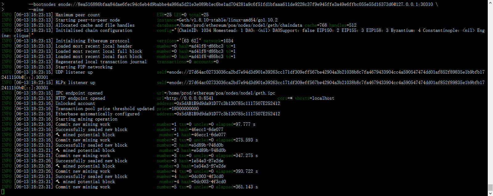
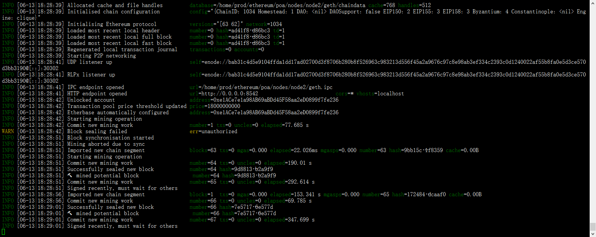

## Table of Content
* [POW 部署](#Ethereum私链部署(POW))
* [POA 部署](#Ethereum私链部署(POA))
* [Proof-Of-Authority 介绍](./poa.md)


## Ethereum私链部署(POW)

- Download
    ```
    # download website  下载 Geth & Tools 最新的 release 版本
    https://geth.ethereum.org/downloads
    ```

    - 静态编译
    ```
    prod@ubuntu:~/ethereum/node-test$ echo $GOPATH
    /home/prod/go

    # 下载代码目录  ~/go/src/github.com/ethereum/go-ethereum
    go get -d github.com/ethereum/go-ethereum

    # checkout to  stable version
    git fetch origin release/1.8:release/1.8
    git checkout release/1.8 

    # 编译
    go install --ldflags '-linkmode external -extldflags "-static"' github.com/ethereum/go-ethereum/cmd/geth
    ```

- 配置环境变量
    ```bash
    # 在 .bashrc 配置文件下添加PATH
    export PATH=/path/to/geth/tools/:$PATH
    source ~/.bashrc
    ```

- 初始化geth账户
    ```bash
    # 创建geth数据存放目录
    prod@ubuntu:~/ethereum/node-test$ mkdir node

    # 初始化 coinbase 钱包地址    geth --datadir node/ account new
    prod@ubuntu:~/ethereum/node-test$ geth --datadir node/ account new
    INFO [06-11|14:42:15] Maximum peer count                       ETH=25 LES=0 total=25
    Your new account is locked with a password. Please give a password. Do not forget this password.
    Passphrase: 
    Repeat passphrase: 
    Address: {fbade207f880faf479f1e76b55efcdeeb303c461}

    ```

- 初始化 genesis.json， 采用POW进行挖矿
    ```bash
    prod@ubuntu:~/ethereum/node-test$ puppeth 
    +-----------------------------------------------------------+
    | Welcome to puppeth, your Ethereum private network manager |
    |                                                           |
    | This tool lets you create a new Ethereum network down to  |
    | the genesis block, bootnodes, miners and ethstats servers |
    | without the hassle that it would normally entail.         |
    |                                                           |
    | Puppeth uses SSH to dial in to remote servers, and builds |
    | its network components out of Docker containers using the |
    | docker-compose toolset.                                   |
    +-----------------------------------------------------------+

    Please specify a network name to administer (no spaces or hyphens, please)
    > borey  

    Sweet, you can set this via --network=borey next time!

    INFO [06-11|14:57:17] Administering Ethereum network           name=borey
    WARN [06-11|14:57:17] No previous configurations found         path=/home/prod/.puppeth/borey

    What would you like to do? (default = stats)
    1. Show network stats
    2. Configure new genesis
    3. Track new remote server
    4. Deploy network components
    > 2

    Which consensus engine to use? (default = clique)
    1. Ethash - proof-of-work
    2. Clique - proof-of-authority
    > 1

    Which accounts should be pre-funded? (advisable at least one)
    > 0xfbade207f880faf479f1e76b55efcdeeb303c461
    > 0x

    Specify your chain/network ID if you want an explicit one (default = random)
    > 1024
    INFO [06-11|14:57:47] Configured new genesis block 

    What would you like to do? (default = stats)
    1. Show network stats
    2. Manage existing genesis
    3. Track new remote server
    4. Deploy network components
    > 2

    1. Modify existing fork rules
    2. Export genesis configuration
    3. Remove genesis configuration
    > 2

    Which file to save the genesis into? (default = borey.json)
    > genesis.json
    INFO [06-11|14:58:17] Exported existing genesis block 

    What would you like to do? (default = stats)
    1. Show network stats
    2. Manage existing genesis
    3. Track new remote server
    4. Deploy network components
    > ^C

    ```

- 私链初始化
    ```bash
    prod@ubuntu:~/ethereum/node-test$ geth --datadir node/ init genesis.json 
    INFO [06-11|15:00:13] Maximum peer count                       ETH=25 LES=0 total=25
    INFO [06-11|15:00:13] Allocated cache and file handles         database=/home/prod/ethereum/node-test/node/geth/chaindata cache=16 handles=16
    INFO [06-11|15:00:13] Writing custom genesis block 
    INFO [06-11|15:00:13] Persisted trie from memory database      nodes=355 size=65.27kB time=809.462µs gcnodes=0 gcsize=0.00B gctime=0s livenodes=1 livesize=0.00B
    INFO [06-11|15:00:13] Successfully wrote genesis state         database=chaindata                                         hash=263108…b658f4
    INFO [06-11|15:00:13] Allocated cache and file handles         database=/home/prod/ethereum/node-test/node/geth/lightchaindata cache=16 handles=16
    INFO [06-11|15:00:13] Writing custom genesis block 
    INFO [06-11|15:00:13] Persisted trie from memory database      nodes=355 size=65.27kB time=866.522µs gcnodes=0 gcsize=0.00B gctime=0s livenodes=1 livesize=0.00B
    INFO [06-11|15:00:13] Successfully wrote genesis state         database=lightchaindata                                         hash=263108…b658f4
    prod@ubuntu:~/ethereum/node-test$ 

    ```

- 运行私链
    ```bash
    geth --identity "borey" --ethash.dagsinmem 0 --rpc --rpcport "8545" --rpcaddr "0.0.0.0" --datadir node --port "30303" --rpccorsdomain "*" --rpcapi "personal,db,eth,net,web3,admin,txpool,miner" --networkid 1024 --nodiscover
    ```

- 连接服务通过ipc
    ```bash
    prod@ubuntu:~/ethereum/node-test$ geth attach node/geth.ipc 
    Welcome to the Geth JavaScript console!

    instance: Geth/borey/v1.8.9-stable-ff9b1461/linux-amd64/go1.10.1
    coinbase: 0xfbade207f880faf479f1e76b55efcdeeb303c461
    at block: 0 (Mon, 11 Jun 2018 14:57:24 CST)
    datadir: /home/prod/ethereum/node-test/node
    modules: admin:1.0 debug:1.0 eth:1.0 miner:1.0 net:1.0 personal:1.0 rpc:1.0 txpool:1.0 web3:1.0

    # 查看 node  coinbase
    > eth.coinbase
    "0xfbade207f880faf479f1e76b55efcdeeb303c461"
    # 查询 coinbase 余额
    > web3.fromWei(eth.getBalance(eth.coinbase), 'ether')
    9.04625697166532776746648320380374280103671755200316906558262375061821325312e+56

    # 查看nodeinfo, 通过admin.addPeer用来添加节点， 注意：修改[::] 为ip地址
    > admin.nodeInfo.enode
    "enode://e45dc30d829a66d8af0eb8279d08645e0276e9f126a5f8bfb60fb16bb7c73692322a9655394f45513e0f418ce80a06072b3eb63c9a34024d1a38e496b0936fd7@[::]:30303?discport=0"
    # 挖矿 开始记账
    > miner.start()
    ```


## Ethereum私链部署(POA)
- 初始化账户
    ```bash
    # 创建 node1 的 coinbase 钱包
    prod@ubuntu:~/ethereum/poa$ geth --datadir nodes/node1  account new
    INFO [06-13|15:25:14] Maximum peer count                       ETH=25 LES=0 total=25
    Your new account is locked with a password. Please give a password. Do not forget this password.
    Passphrase: 
    Repeat passphrase: 
    Address: {5dab1b9d9da91d77c3b130785c1117507e252412}
    
    # 创建 node2 的 coinbase 钱包
    prod@ubuntu:~/ethereum/poa$ geth --datadir nodes/node2  account new
    INFO [06-13|15:25:39] Maximum peer count                       ETH=25 LES=0 total=25
    Your new account is locked with a password. Please give a password. Do not forget this password.
    Passphrase: 
    Repeat passphrase: 
    Address: {e1ace7e1a98ab69abdd45f58aa2ed0899f7fe236}

    ```

- 初始化 genesis.json， 采用POA进行挖矿
    ```bash
    prod@ubuntu:~/ethereum/poa$ puppeth 
    +-----------------------------------------------------------+
    | Welcome to puppeth, your Ethereum private network manager |
    |                                                           |
    | This tool lets you create a new Ethereum network down to  |
    | the genesis block, bootnodes, miners and ethstats servers |
    | without the hassle that it would normally entail.         |
    |                                                           |
    | Puppeth uses SSH to dial in to remote servers, and builds |
    | its network components out of Docker containers using the |
    | docker-compose toolset.                                   |
    +-----------------------------------------------------------+

    Please specify a network name to administer (no spaces or hyphens, please)
    > poaNet    

    Sweet, you can set this via --network=poaNet next time!

    INFO [06-13|15:27:46] Administering Ethereum network           name=poaNet
    WARN [06-13|15:27:46] No previous configurations found         path=/home/prod/.puppeth/poaNet

    What would you like to do? (default = stats)
    1. Show network stats
    2. Configure new genesis
    3. Track new remote server
    4. Deploy network components
    > 2

    # 共识机制选择 POA
    Which consensus engine to use? (default = clique)
    1. Ethash - proof-of-work
    2. Clique - proof-of-authority
    > 2

    # 配置出块时间间隔
    How many seconds should blocks take? (default = 15)
    > 5

    # 配置初始化权限账户
    Which accounts are allowed to seal? (mandatory at least one)
    > 0x5dab1b9d9da91d77c3b130785c1117507e252412
    > 0x

    # 初始化钱包
    Which accounts should be pre-funded? (advisable at least one)
    > 0x5dab1b9d9da91d77c3b130785c1117507e252412
    > 0x

    Specify your chain/network ID if you want an explicit one (default = random)
    > 1034
    INFO [06-13|15:28:46] Configured new genesis block 

    What would you like to do? (default = stats)
    1. Show network stats
    2. Manage existing genesis
    3. Track new remote server
    4. Deploy network components
    > 2

    1. Modify existing fork rules
    2. Export genesis configuration
    3. Remove genesis configuration
    > 2

    Which file to save the genesis into? (default = poaNet.json)
    > genesis_poa_net.json    
    INFO [06-13|15:29:22] Exported existing genesis block 

    What would you like to do? (default = stats)
    1. Show network stats
    2. Manage existing genesis
    3. Track new remote server
    4. Deploy network components
    > ^C
    prod@ubuntu:~/ethereum/poa$ ls
    genesis_poa_net.json  nodes

    ```

- 初始化节点
    ```bash
    prod@ubuntu:~/ethereum/poa$ geth --datadir nodes/node1 init genesis_poa_net.json 
    INFO [06-13|15:44:43] Maximum peer count                       ETH=25 LES=0 total=25
    INFO [06-13|15:44:43] Allocated cache and file handles         database=/home/prod/ethereum/poa/nodes/node1/geth/chaindata cache=16 handles=16
    INFO [06-13|15:44:43] Writing custom genesis block 
    INFO [06-13|15:44:43] Persisted trie from memory database      nodes=355 size=65.27kB time=1.55262ms gcnodes=0 gcsize=0.00B gctime=0s livenodes=1 livesize=0.00B
    INFO [06-13|15:44:43] Successfully wrote genesis state         database=chaindata                                          hash=29ea83…bf0671
    INFO [06-13|15:44:43] Allocated cache and file handles         database=/home/prod/ethereum/poa/nodes/node1/geth/lightchaindata cache=16 handles=16
    INFO [06-13|15:44:43] Writing custom genesis block 
    INFO [06-13|15:44:43] Persisted trie from memory database      nodes=355 size=65.27kB time=769.432µs gcnodes=0 gcsize=0.00B gctime=0s livenodes=1 livesize=0.00B
    INFO [06-13|15:44:43] Successfully wrote genesis state         database=lightchaindata                                          hash=29ea83…bf0671
    prod@ubuntu:~/ethereum/poa$ geth --datadir nodes/node2 init genesis_poa_net.json 
    INFO [06-13|15:44:49] Maximum peer count                       ETH=25 LES=0 total=25
    INFO [06-13|15:44:49] Allocated cache and file handles         database=/home/prod/ethereum/poa/nodes/node2/geth/chaindata cache=16 handles=16
    INFO [06-13|15:44:49] Writing custom genesis block 
    INFO [06-13|15:44:49] Persisted trie from memory database      nodes=355 size=65.27kB time=871.627µs gcnodes=0 gcsize=0.00B gctime=0s livenodes=1 livesize=0.00B
    INFO [06-13|15:44:49] Successfully wrote genesis state         database=chaindata                                          hash=29ea83…bf0671
    INFO [06-13|15:44:49] Allocated cache and file handles         database=/home/prod/ethereum/poa/nodes/node2/geth/lightchaindata cache=16 handles=16
    INFO [06-13|15:44:49] Writing custom genesis block 
    INFO [06-13|15:44:49] Persisted trie from memory database      nodes=355 size=65.27kB time=831.795µs gcnodes=0 gcsize=0.00B gctime=0s livenodes=1 livesize=0.00B
    INFO [06-13|15:44:49] Successfully wrote genesis state         database=lightchaindata                                          hash=29ea83…bf0671
    ```
- 创建bootnode, 用于节点之间的发现
    ```bash
    # 初始化
    prod@ubuntu:~/ethereum/poa/nodes$ mkdir bootnode
    prod@ubuntu:~/ethereum/poa/nodes$ bootnode -genkey bootnode/boot.key

    # 运行bootnode
    prod@ubuntu:~/ethereum/poa/nodes$ bootnode -nodekey bootnode/boot.key  -addr :30310
    INFO [06-13|18:07:11] UDP listener up                          self=enode://8ea516886bfaa84dae6fec94c6eb4d9babbe4a986a5d21e3e089b1ec6be1ad704281a9c6f51fd1bfaaa611de9228c37f9e945ffe3a49e6ffbc055e55d16373d6@[::]:30310
    ```

- 运行私链
    ```bash
    echo "wallet password" > nodes/node1/password 
    # node1 bootstrap 并进行挖矿
    geth --syncmode 'full' \
         --rpc --rpcport "8541" --rpcaddr "0.0.0.0" \
         --datadir nodes/node1 --port "30301" --rpccorsdomain "*" \
         --rpcapi "personal,db,eth,net,web3,admin,txpool,miner,clique" \
         --networkid 1034  \
         --unlock 0x5dab1b9d9da91d77c3b130785c1117507e252412  \
         --password nodes/node1/password  \
         --bootnodes enode://8ea516886bfaa84dae6fec94c6eb4d9babbe4a986a5d21e3e089b1ec6be1ad704281a9c6f51fd1bfaaa611de9228c37f9e945ffe3a49e6ffbc055e55d16373d6@127.0.0.1:30310 \
         --mine
    ```
    node1 节点 log:
    

- 添加节点
    - 登录node1 console , 添加 node2 对应的 coinbase
        ```
        prod@ubuntu:~/ethereum/poa$ geth attach nodes/node1/geth.ipc
        Welcome to the Geth JavaScript console!

        instance: Geth/v1.8.10-stable/linux-amd64/go1.10.2
        coinbase: 0x5dab1b9d9da91d77c3b130785c1117507e252412
        at block: 53 (Wed, 13 Jun 2018 18:27:36 CST)
        datadir: /home/prod/ethereum/poa/nodes/node1
        modules: admin:1.0 clique:1.0 debug:1.0 eth:1.0 miner:1.0 net:1.0 personal:1.0 rpc:1.0 txpool:1.0 web3:1.0

        # 添加 signer 地址
        > clique.propose("0xe1ACe7e1a98AB69aBDd45F58aa2eD0899f7fe236", true)
        null
        ```
    
    - 启动 node2 节点
        ```bash
        echo "wallet password" > nodes/node2/password 
        # node2 bootstrap
        geth --syncmode 'full' \
            --rpc --rpcport "8542" --rpcaddr "0.0.0.0" \
            --datadir nodes/node2 --port "30302" --rpccorsdomain "*" \
            --rpcapi "personal,db,eth,net,web3,admin,txpool,miner,clique" \
            --networkid 1034  \
            --unlock 0xe1ACe7e1a98AB69aBDd45F58aa2eD0899f7fe236  \
            --password nodes/node2/password  \
            --bootnodes enode://8ea516886bfaa84dae6fec94c6eb4d9babbe4a986a5d21e3e089b1ec6be1ad704281a9c6f51fd1bfaaa611de9228c37f9e945ffe3a49e6ffbc055e55d16373d6@127.0.0.1:30310 \
            --mine 
        ```
        node2 log:
        

    - 依次类推进行添加 node 3 .. n