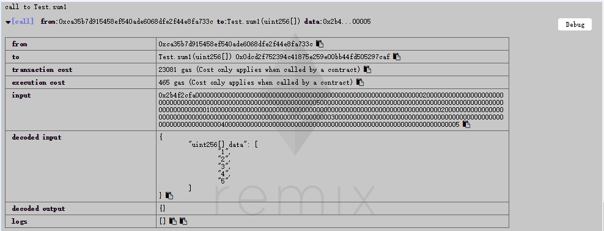
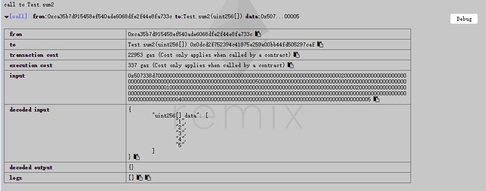
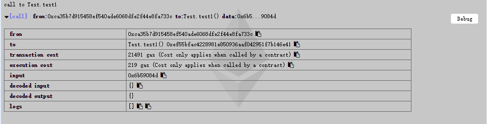
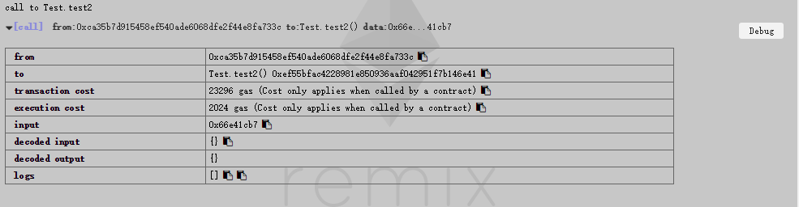
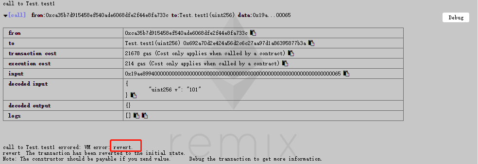
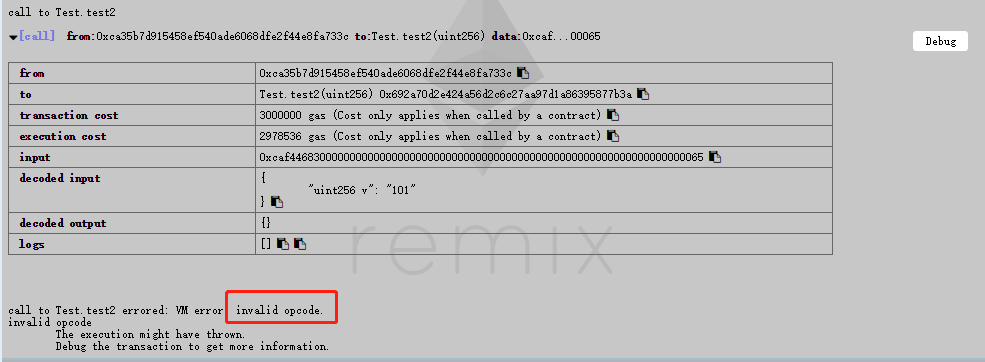

# 目录
* [basics](#basics)
* [solidity functions and variables](#solidity-functions-and-variables)
* [different between public and external](#different-between-public-and-external)<!-- * [different between private and internal](#different-between-private-and-internal) -->
* [different between prue and view](#different-between-prue-and-view)
* [different between require and assert](#different-between-require-and-assert)
* [send ether from contract to another contract](#send-ether-from-contract-to-another-contract)
* [modifer function with parameters](#modifer-function-with-parameters)


# 总结

## basics

- [【官网】数据类型](https://solidity.readthedocs.io/en/latest/types.html)
- [【官网】全局有效变量及内置函数](https://solidity.readthedocs.io/en/latest/units-and-global-variables.html)
- [【官网】表达式和控制结构](https://solidity.readthedocs.io/en/latest/control-structures.html) 
- [【官网】智能合约](https://solidity.readthedocs.io/en/latest/contracts.html)
    - [【官网】函数](https://solidity.readthedocs.io/en/latest/contracts.html#functions)
    - [【官网】Modifier](https://solidity.readthedocs.io/en/latest/contracts.html#function-modifiers): 类似于Python中的装饰器
    - [【官网】继承](https://solidity.readthedocs.io/en/latest/contracts.html#inheritance)
    - [【官网】抽象](https://solidity.readthedocs.io/en/latest/contracts.html#abstract-contracts)
    - [【官网】接口](https://solidity.readthedocs.io/en/latest/contracts.html#interfaces)： 类似于Java、Go 中的 Interface；
    - [【官网】函数库、using for](https://solidity.readthedocs.io/en/latest/contracts.html#libraries):  类似Scala中的隐式转换，为类型或结构体添加成员函数 ；

## solidity functions and variables
官方原文：

&emsp;&emsp;Since Solidity knows two kinds of function calls (internal ones that do not create an actual EVM call (also called a “message call”) and external ones that do), there are four types of visibilities for functions and state variables.<BR>
&emsp;&emsp;Functions can be specified as being external, public, internal or private, where the default is public. For state variables, external is not possible and the default is internal.<BR>

external: <BR>
&emsp;&emsp;External functions are part of the contract interface, which means they can be called from other contracts and via transactions. An external function f cannot be called internally (i.e. f() does not work, but this.f() works). External functions are sometimes more efficient when they receive large arrays of data.

public: <BR>
&emsp;&emsp;Public functions are part of the contract interface and can be either called internally or via messages. For public state variables, an automatic getter function (see below) is generated.

internal: <BR>
&emsp;&emsp;Those functions and state variables can only be accessed internally (i.e. from within the current contract or contracts deriving from it), without using this.

private: <BR>
&emsp;&emsp;Private functions and state variables are only visible for the contract they are defined in and not in derived contracts.

概述：

Solidity 有两种函数形式调用：
1) 内部调用（internal）, `不创建EVM的调用也被称为消息调用`；
2) 外部调用（external）, 言外之意就是需要创建实际的EVM进行调用；

Solidity 函数和变量：
1) 函数可声明为有四种类型：external, public, internal or private;
2) 变量可声明为有三种类型：public, internal or private;
3) 函数默认为 `public`;
4) 变量默认为 `internal`;

external：
1) 智能合约对外部的接口函数可以定义为 external 类型， `在接收大数组时更高效（如何高效？ 下面章节详细描述）`;
2) 定义为该类型的函数，在智能合约中不能直接调用，需要通过 `this.` 调用;

public:
1) 智能合约对外部的接口函数也可以定义为 public 类型， 也可以在该智能合约中进行内部调用（消息调用）;
2) 变量声明为public时, solidity会对该变量生成一个getter方法； 例如： 定义 了变量 data, 可用过contract instance 进行方法  .data() 调用；

internal:
1) 该类型声明的方法或变量，只能在合约内或在子合约中进行访问, 不需要使用 `this`；

private:
1) 该类型声明的方法或变量，只能在该合约访问， 子合约无权访问；


## Different between public and external 
### Summary
1) public 和 external 都可以提供给内部和外部使用；
2) external 在传递大数组时效率更高，消耗的gas较少
    - public 属于内部调用, 内部调用通过代码中的跳转执行，数组参数通过指向内存的指针在内部传递，因此当编译器为内部函数生成代码时，该函数期望其参数位于内存中， 所以需要拷贝所有参数到内存中；
    - external 属于外部调用， 允许函数直接读取参数通过 `calldata` 方法, 省去了内存复制操作；
3) public 在合约内部使用更高效， 因为 external 函数需要构建EVM进行CALL指令代价昂贵；

### 数据传输测试
```solidity
pragma solidity ^0.4.24;

contract Test {
    
    function sum1(uint256[] data) public pure {
        require(data[1] > 0);
    }
    
    function sum2(uint256[] data) external pure {
        require(data[1] > 0);
    }
}
```
Result: public 函数调用消耗了465 gas


Result: external 函数调用消耗了337 gas



### 合约内部调用public 和 external 测试
```solidity
pragma solidity ^0.4.24;

contract Test {
    function test1() public view {
        require(show1() == 256);
    }
    
    function test2() public view {
        require(this.show2() == 256);
    }
    
    function show1() public pure returns (uint256){
        return uint256(256);
    }
    
    function show2() external pure returns (uint256){
        return uint256(256);
    }   
}
```
Result: public 函数调用消耗了219 gas


Result: external 函数调用消耗了2024 gas


## Different between prue and view
`prue` 和 `view` 是由常量`constant` 改进后新的修饰符， [github issue](https://github.com/ethereum/solidity/issues/992) 中进行了相关描述。

### 官方文档
- View Functions 

    Functions can be declared view in which case they promise not to modify the state.

    The following statements are considered modifying the state:
    - Writing to state variables.
    - Emitting events.
    - Creating other contracts.
    - Using selfdestruct.
    - Sending Ether via calls.
    - Calling any function not marked view or pure.
    - Using low-level calls.
    - Using inline assembly that contains certain opcodes.

    Warning: The compiler does not enforce yet that a view method is not modifying state. It raises a warning though.

- Pure Functions

    Functions can be declared pure in which case they promise not to read from or modify the state.

    In addition to the list of state modifying statements explained above, the following are considered reading from the state:
    - Reading from state variables.
    - Accessing this.balance or <address>.balance.
    - Accessing any of the members of block, tx, msg (with the exception of msg.sig and msg.data).
    - Calling any function not marked pure.
    - Using inline assembly that contains certain opcodes.

    Warning: It is not possible to prevent functions from reading the state at the level of the EVM, it is only possible to prevent them from writing to the state (i.e. only view can be enforced at the EVM level, pure can not).

    Warning: Before version 0.4.17 the compiler didn’t enforce that pure is not reading the state.

### summary
1) `view`修饰的函数 promise 不修改合约状态，意味着不能使用 `SSTORE`，不能发送或接收Ether，只能调用其他 view 方法或纯函数。
2) `pure`修饰的函数 相对 `view`修饰的函数 额外地 promise 不能读取合约状态, 意味着不能使用 `SSTORE`、`SLOAD` , 不能发送或接收Ether， 不能使用全局变量 `msg`、`block`等, 只能调用其他 pure 方法。
3) `BUT` 编译器不会强制 `view` 函数不能修改状态，只会进行Warning警告！
4) `BUT` 编译器不会强制 `prue` 函数不能读取状态，只会进行Warning警告！

## Different between require and assert
### 官方文档
&emsp;&emsp;[Error handling: Assert, Require, Revert and Exceptions](https://solidity.readthedocs.io/en/develop/control-structures.html#error-handling-assert-require-revert-and-exceptions)

&emsp;&emsp;Internally, Solidity performs a revert operation (instruction 0xfd) for a require-style exception and executes an invalid operation (instruction 0xfe) to throw an assert-style exception. In both cases, this causes the EVM to revert all changes made to the state. The reason for reverting is that there is no safe way to continue execution, because an expected effect did not occur. Because we want to retain the atomicity of transactions, the safest thing to do is to revert all changes and make the whole transaction (or at least call) without effect. Note that assert-style exceptions consume all gas available to the call, while require-style exceptions will not consume any gas starting from the Metropolis release.

### Summary
1. solidity使用state-reverting异常来处理错误,自动恢复此次call修改的状态；
2. require 通常用于检测确定的条件(如 input 或 contract state variables)，或验证调用其他contract函数的返回值， 会经常使用；
3. assert  通常用来测试内部调用错误，或特殊的约束条件， 尽量通过代码层避免；
4. require（指令 [0xfd](https://github.com/ethereum/solidity/blob/v0.4.24/libevmasm/Instruction.h#L198)）
是 `REVERT opcode` ,意味着会退还剩余的GAS；
5. assert（指令 [0xfe](https://github.com/ethereum/solidity/blob/v0.4.24/libevmasm/Instruction.h#L199)） 是 `INVALID opcode`, 将使用完该次调用所需要的GAS；

### Gas消耗测试
```solidity
pragma solidity ^0.4.24;

contract Test {
    function test1(uint256 v) public view {
        require(v == 256);
    }
    function test2(uint256 v) public view {
        assert(v == 256);
    }
}
```

require 抛出的VM Error 为 Revert, 消耗了 214 GAS；


assert 抛出的VM Error 为 Invalid, 消耗了 2978536 GAS；



## Send ether from contract to another contract


## Modifer function with parameters


