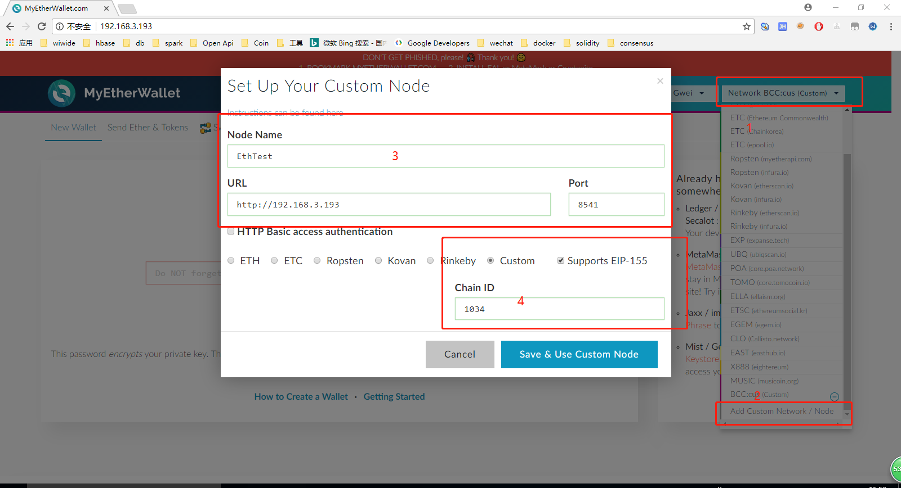

# Docker 部署 MyEtherWallet

- download

    下载最新版本的etherwallet https://github.com/kvhnuke/etherwallet/releases

- Write Dockerfile
    ```docker
    FROM nginx
    WORKDIR /etherwallet

    ADD dist /usr/share/nginx/html
    RUN echo "server {\
    listen 80; \
    server_name localhost; \
    location / { \
        root   /usr/share/nginx/html; \
        index  index.html index.htm; \
    }\
    error_page   500 502 503 504  /50x.html;\
    location = /50x.html {\
        root   /usr/share/nginx/html;\
    }\
    }" > /etc/nginx/conf.d/wallet.conf

    EXPOSE 80

    CMD ["nginx", "-g", "daemon off;"]
    ```
- tree directory
    ```bash
    prod@ubuntu:~/ethereum$ tree -L 2 etherwallet-v3.21.12
    etherwallet-v3.21.12
    ├── dist
    │   ├── bin
    │   ├── contest.html
    │   ├── css
    │   ├── embedded.html
    │   ├── fonts
    │   ├── helpers.html
    │   ├── images
    │   ├── index.html
    │   ├── js
    │   ├── package.json
    │   ├── phishing.html
    │   ├── README.md
    │   └── signmsg.html
    └── Dockerfile

    6 directories, 9 files

    ```

- docker compile && run
    ```bash
    # 编译
    docker build  -t etherwallet:latest .

    # 部署
    docker run -d --name etherwallet -p 0.0.0.0:80:80  etherwallet:latest
    ```

- Add Custom Network

    按照下图 1、2、3、4 步骤填写私链信息保存：
    
    
- notice
    
    当使用`ssl`时，无法连接本地geth节点

